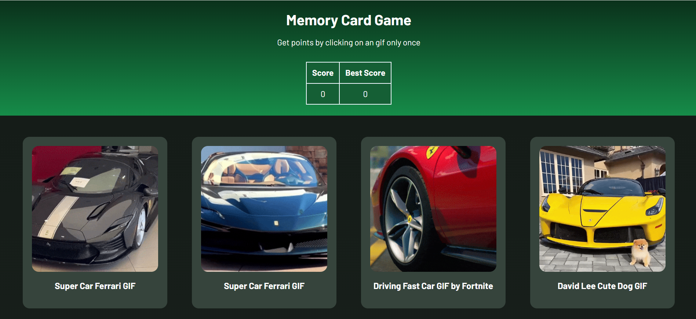

# Memory Card
## Description
In this project, i have created a game in which the users get points by clicking on an gif only once.

### Screenshot

## Steps
1. Created a new React project.

2. Think about how to structure the application, and how to get the images from an API. 

3. Include a scoreboard, which counts the current score, and a “Best Score”, which shows the highest score achieved thus far. 

4. Include a function that displays the cards in a random order anytime a user clicks one. 

5. Fetch the images and texts used in the cards from an external API. ([Giphy's](https://giphy.com) API)